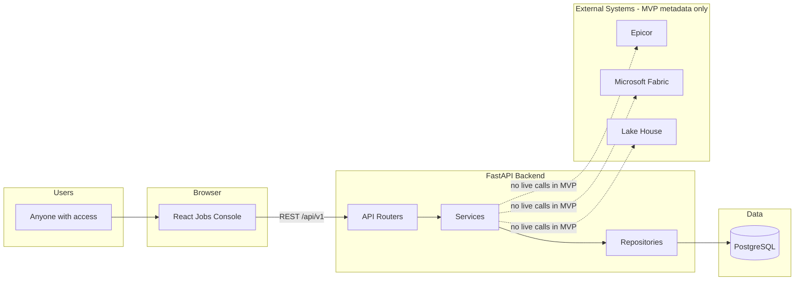
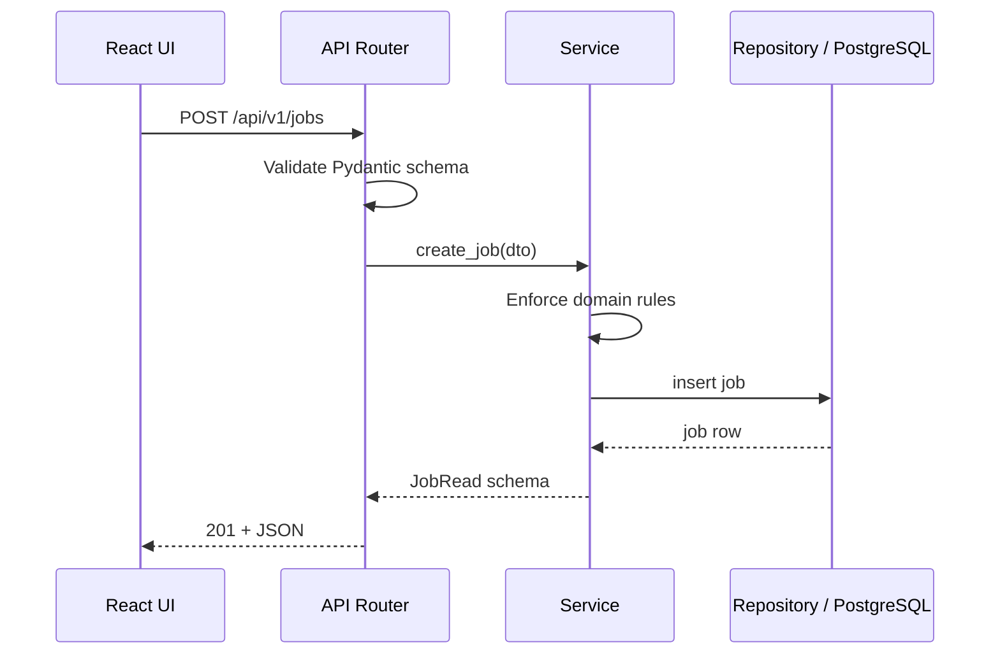
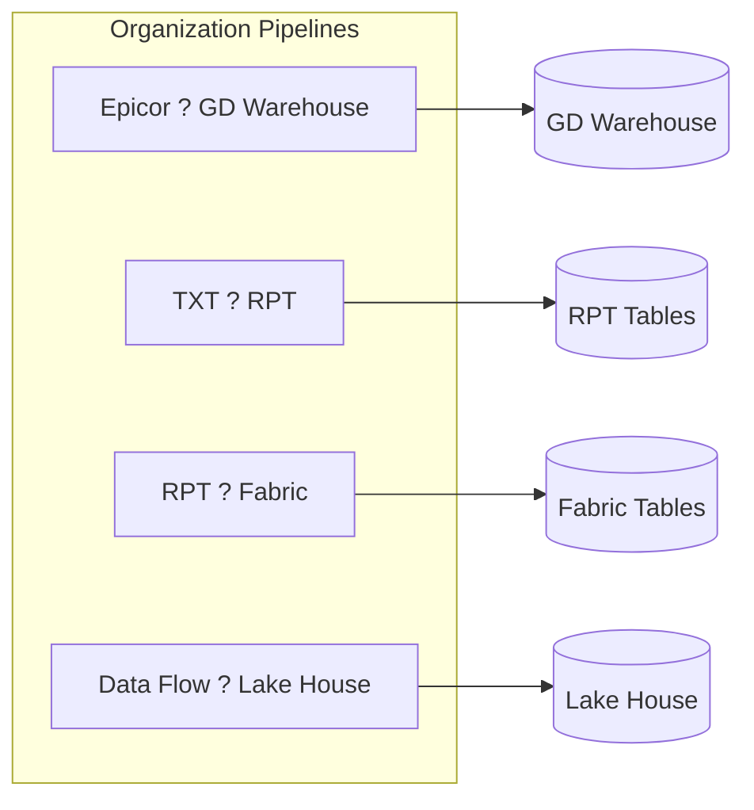
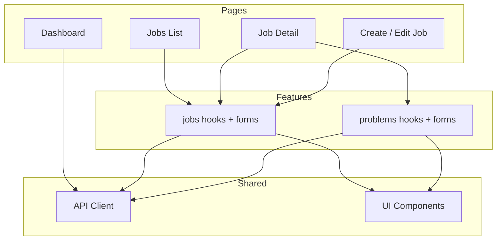

# Solution Architecture
# Organization Job Handler ? MVP

**Version:** 0.1  
**Status:** Awaiting approval before folder scaffold (Step 10)

---

## 1. Architectural goals

- **Thin vertical slices** ? ship one resource (Jobs, then Problems) end-to-end before expanding
- **Clear boundaries** ? UI talks only to REST API; API talks only to PostgreSQL via service/repository layers
- **Domain fidelity** ? Job, JobProblem, JobRun; four pipeline types as enums/templates
- **MVP pragmatism** ? open full access (no auth/roles), simulated runs, metadata-only external systems

---

## 2. High-level system context



---

## 3. Monorepo layout

```
Job Handler/
??? frontend/                 React + Vite + TypeScript
?   ??? src/
?   ?   ??? pages/            Dashboard, JobsList, JobDetail, CreateJob
?   ?   ??? features/
?   ?   ?   ??? jobs/         hooks, forms, types
?   ?   ?   ??? problems/   problem forms, resolve flow
?   ?   ??? components/       badges, table, modal, toast
?   ?   ??? api/              typed HTTP client
?   ??? .env.example
?
??? backend/                  Python FastAPI
?   ??? app/
?   ?   ??? main.py           app entry, CORS, middleware
?   ?   ??? api/v1/           routers (jobs, problems, runs, health)
?   ?   ??? core/             config, database session, deps
?   ?   ??? models/           SQLAlchemy models
?   ?   ??? schemas/          Pydantic request/response
?   ?   ??? services/         business logic
?   ?   ??? repositories/     DB queries
?   ??? alembic/              migrations
?   ??? tests/
?   ??? .env.example
?
??? docs/                     SRS, stories, architecture, data model
??? .env.docker.example
??? .env.production.example
??? docker-compose.yml        (later ? Step 40)
```

**Principle:** No shared code package in MVP ? TypeScript types mirror Pydantic schemas manually (keep in sync via review).

---

## 4. Request flow (backend)



| Layer | Responsibility | Must not |
|-------|----------------|----------|
| **Router** | HTTP, status codes, dependency injection | Business rules, raw SQL |
| **Service** | Validation, orchestration, transactions | HTTP concerns |
| **Repository** | Queries, persistence | API response shaping |
| **Schema** | Request/response contracts | DB access |

---

## 5. API design

### Versioning

- Base path: `/api/v1`
- Health: `GET /health` (or `/api/v1/health`)
- OpenAPI: FastAPI auto `/docs`

### Resource endpoints (MVP)

| Resource | Endpoints |
|----------|-----------|
| Jobs | `GET/POST /jobs`, `GET/PATCH/DELETE /jobs/{id}`, `POST /jobs/{id}/archive` |
| Problems | `GET/POST /jobs/{id}/problems`, `GET/PATCH /problems/{id}`, `POST /problems/{id}/resolve` |
| Runs | `GET /jobs/{id}/runs`, `POST /jobs/{id}/runs/simulate` |
| Dashboard | `GET /dashboard/summary` (aggregates) |

### Query parameters (list endpoints)

- `page`, `page_size`
- `search` (job name)
- `job_type`, `status`
- `sort_by`, `sort_order`
- `unresolved_only` (problems)

### Error contract

```json
{
  "detail": "Human-readable message",
  "code": "VALIDATION_ERROR",
  "fields": { "name": "Required" }
}
```

---

## 6. Pipeline job types (domain)



| Enum | Label | Source | Target |
|------|-------|--------|--------|
| `EPICOR_GD_WH_SYNC` | Epicor ? GD Warehouse | Epicor | GD Warehouse |
| `TXT_TO_RPT` | TXT ? RPT | TXT | RPT |
| `RPT_TO_FABRIC` | RPT ? Fabric | RPT | Fabric |
| `DATAFLOW_TO_LAKEHOUSE` | Data Flow ? Lake House | Data Flow | Lake House |

Templates pre-fill `job_type`, `source_system`, `target_system`, and a minimal `config` JSON stub.

---

## 7. Access control

| Aspect | Decision |
|--------|----------|
| Auth | **None** - intentional open full access |
| Roles | **None** - no Admin / Operator / Viewer |
| CORS | Restrict browser origin via CLIENT_URL (e.g. http://localhost:5173) |
| API | All Job / JobProblem / JobRun / template endpoints usable without credentials |

Anyone who can reach the console or API can create, edit, archive, log problems, resolve, and simulate runs.

## 8. Database & migrations

| Aspect | Decision |
|--------|----------|
| Engine | PostgreSQL (Neon pooled URL or local Postgres) |
| ORM | SQLAlchemy 2.x |
| Migrations | Alembic ? review SQL before `upgrade` |
| Soft delete | `archived_at` on jobs; default lists exclude archived |
| JSON fields | `config` on Job, `metadata` on JobProblem |

**Indexing (planned):** `job_type`, `status`, `updated_at`, `job_id` on problems, `resolved_at` for unresolved filter.

---

## 9. Frontend architecture



| Concern | Approach |
|---------|----------|
| Routing | React Router ? `/`, `/jobs`, `/jobs/new`, `/jobs/:id`, `/jobs/:id/edit` |
| Data fetching | `fetch` or lightweight wrapper; no Redux in MVP |
| State | Local component state + custom hooks per feature |
| Env | `VITE_API_URL` ? `http://localhost:5000/api/v1` |
| UX | Loading skeleton, empty state, toast on success/error on every mutation |

---

## 10. Simulated job runs (MVP)

No worker process in MVP.

1. User clicks **Simulate run** on Job Detail
2. API creates `JobRun` with `queued` ? immediately transitions to `running` ? random or rule-based `succeeded`/`failed`
3. On `failed`, UI offers **Create problem from run**
4. No call to Epicor, Fabric, or Lake House

**Future:** Replace simulate endpoint with job queue + worker without changing UI contract drastically.

---

## 11. Environment configuration

Aligned with Ticket Management System pattern:

| Variable | Where | Purpose |
|----------|-------|---------|
| `DATABASE_URL` | Backend | Postgres connection |
| `PORT` | Backend | API port (5000) |
| `CLIENT_URL` | Backend | CORS allowed origin |
| `VITE_API_URL` | Frontend | Browser ? API base URL |

Templates already exist at repo root and in backend/frontend folders.

---

## 12. Risks & mitigations

| Risk | Severity | Mitigation |
|------|----------|------------|
| N+1 queries loading jobs + problems | Major | Eager load or separate aggregated endpoints; pagination always |
| Unbounded job run / problem history | Major | Pagination; optional retention policy later |
| Secret leakage in logs or git | Critical | Structured logging without connection strings; `.env` gitignored |
| UI/API type drift | Major | Shared enum labels in one frontend map; review on each API change |
| Open full access (no auth) | Major | Trusted network only; no public internet exposure without a gateway |
| Agent generates logic in routers | Minor | Enforce service layer in rules and review |
| Migration applied without review | Critical | Human approval gate before `alembic upgrade` |

---

## 13. Deployment sketch (later)

Not implemented in Step 9. Planned alignment with Ticket project:

- `docker-compose.yml` ? Postgres (or external Neon), API, UI
- GitHub Actions ? pytest + vitest on PR
- Branch `Vardhan` ? feature branches ? PR

---

## 14. Build order (after approval)

1. Folder scaffold only (Step 10)
2. Data model + ER diagram (Step 11)
3. Alembic migration draft (Step 12)
4. FastAPI core (Step 13)
5. Jobs API (Step 14)
6. Problems API (Step 15)
7. React scaffold ? pages in story order

---

## 15. Approval checklist

Before Step 10 (folder scaffold), confirm:

- [ ] Monorepo layout acceptable
- [ ] `/api/v1` resource design acceptable
- [ ] Open full access (no roles / no login) acceptable
- [ ] Simulated runs acceptable
- [ ] PostgreSQL + Alembic acceptable

**Approve architecture** to proceed to Step 10.
