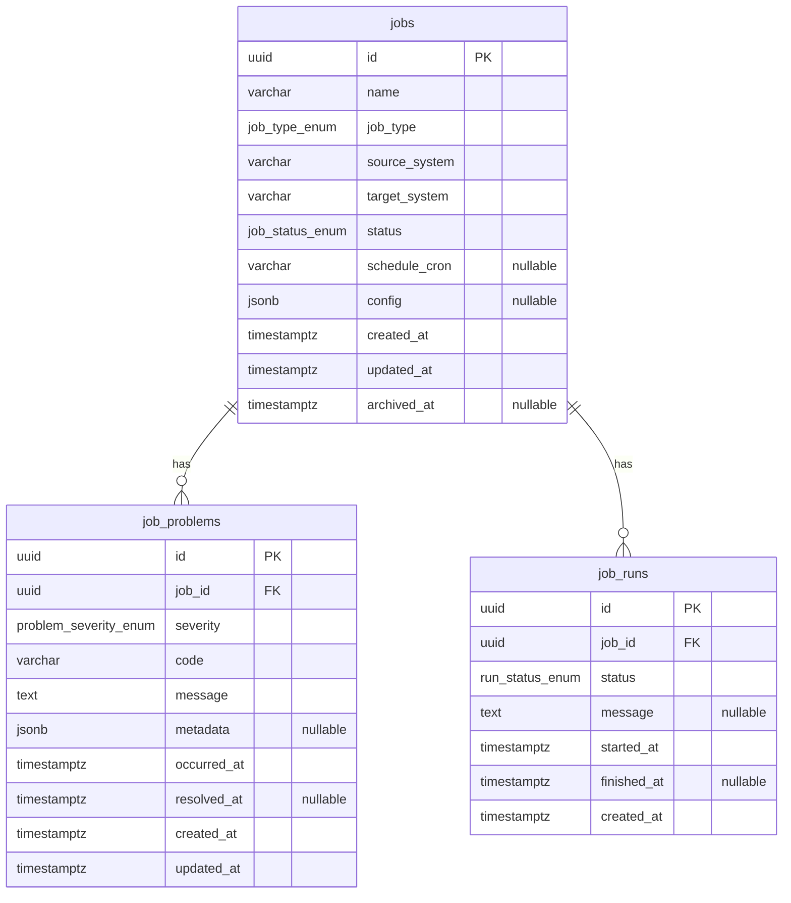

# Data Model
# Organization Job Handler — PostgreSQL (Neon)

**Version:** 0.1  
**Database:** Neon PostgreSQL (pooled connection, SSL required)  
**Status:** Awaiting approval before migrations (Step 12)

---

## 1. Overview

Three core tables for MVP:

| Table | Purpose |
|-------|---------|
| `jobs` | Pipeline job catalog — the aggregate root |
| `job_problems` | Operational issues linked to a job (`status`: open/closed) |
| `job_solutions` | Fixes for a job problem (closes the problem when created) |
| `job_runs` | Simulated execution history (MVP) |

Relationships:

- One **Job** has many **JobProblems**
- One **Job** has many **JobRuns**
- One **JobProblem** has many **JobSolutions** (`job_problem_id`)
- Soft archive on job only; problems/solutions/runs are not hard-deleted with the job

---

## 2. Entity-relationship diagram



---

## 3. Enums

### `job_type_enum`

| Value | Label | Source | Target |
|-------|-------|--------|--------|
| `EPICOR_GD_WH_SYNC` | Epicor → GD Warehouse | Epicor | GD Warehouse |
| `TXT_TO_RPT` | TXT → RPT | TXT | RPT |
| `RPT_TO_FABRIC` | RPT → Fabric | RPT | Fabric |
| `DATAFLOW_TO_LAKEHOUSE` | Data Flow → Lake House | Data Flow | Lake House |
| `TASK_SCHEDULER` | Task Scheduler | Windows Task Scheduler | Job Handler |

### `job_status_enum`

| Value | Meaning |
|-------|---------|
| `draft` | Created but not yet active |
| `active` | In operational use |
| `paused` | Temporarily stopped |
| `archived` | Soft-deleted; hidden from default lists |

### `problem_severity_enum`

`low` · `medium` · `high` · `critical`

### `run_status_enum`

`queued` · `running` · `succeeded` · `failed`

---

## 4. Table: `jobs`

| Column | Type | Nullable | Notes |
|--------|------|----------|-------|
| `id` | UUID | NO | Primary key, default `gen_random_uuid()` |
| `name` | VARCHAR(255) | NO | Display name, indexed for search |
| `job_type` | `job_type_enum` | NO | Pipeline / Task Scheduler type |
| `source_system` | VARCHAR(128) | NO | e.g. Epicor, TXT, RPT, Data Flow |
| `target_system` | VARCHAR(128) | NO | e.g. GD Warehouse, RPT, Fabric, Lake House |
| `status` | `job_status_enum` | NO | Default `draft` |
| `schedule_cron` | VARCHAR(64) | YES | Cron expression; metadata only in MVP |
| `config` | JSONB | YES | Pipeline-specific settings (paths, tables, watermark) |
| `created_at` | TIMESTAMPTZ | NO | Default `now()` |
| `updated_at` | TIMESTAMPTZ | NO | Default `now()`, updated on change |
| `archived_at` | TIMESTAMPTZ | YES | Set when archived; `status` → `archived` |

### Pipeline defaults (templates)

When creating from template, these source/target pairs are enforced:

```
EPICOR_GD_WH_SYNC     → Epicor        → GD Warehouse
TXT_TO_RPT            → TXT           → RPT
RPT_TO_FABRIC         → RPT           → Fabric
DATAFLOW_TO_LAKEHOUSE → Data Flow     → Lake House
TASK_SCHEDULER        → Windows Task Scheduler → Job Handler
```

### Indexes (planned)

- `idx_jobs_job_type` on (`job_type`)
- `idx_jobs_status` on (`status`)
- `idx_jobs_updated_at` on (`updated_at` DESC)
- `idx_jobs_name_trgm` on (`name`) — optional, for ILIKE search
- Partial: `idx_jobs_active` on (`updated_at`) WHERE `archived_at IS NULL`

### Business rules

- Default list queries: `WHERE archived_at IS NULL`
- Archive sets `status = archived` and `archived_at = now()`
- `job_type` + `source_system` + `target_system` should match template defaults (validated in service layer)

---

## 5. Table: `job_problems`

| Column | Type | Nullable | Notes |
|--------|------|----------|-------|
| `id` | UUID | NO | Primary key |
| `job_id` | UUID | NO | FK → `jobs.id` ON DELETE RESTRICT |
| `severity` | `problem_severity_enum` | NO | Default `medium` |
| `code` | VARCHAR(64) | NO | Short error code, e.g. `SYNC_TIMEOUT` |
| `message` | TEXT | NO | Human-readable description |
| `metadata` | JSONB | YES | Extra context (row counts, file name, etc.) |
| `occurred_at` | TIMESTAMPTZ | NO | When the problem happened |
| `resolved_at` | TIMESTAMPTZ | YES | NULL = unresolved |
| `created_at` | TIMESTAMPTZ | NO | Default `now()` |
| `updated_at` | TIMESTAMPTZ | NO | Default `now()` |

### Indexes (planned)

- `idx_job_problems_job_id` on (`job_id`)
- `idx_job_problems_unresolved` on (`job_id`, `occurred_at`) WHERE `resolved_at IS NULL`
- `idx_job_problems_severity` on (`severity`)

### Business rules

- Resolve: set `resolved_at = now()` (PATCH resolve endpoint)
- Unresolved filter: `WHERE resolved_at IS NULL`
- Cannot create problem for archived job (service validation)

---

## 6. Table: `job_runs`

| Column | Type | Nullable | Notes |
|--------|------|----------|-------|
| `id` | UUID | NO | Primary key |
| `job_id` | UUID | NO | FK → `jobs.id` ON DELETE RESTRICT |
| `status` | `run_status_enum` | NO | Default `queued` |
| `message` | TEXT | YES | Outcome or error summary |
| `started_at` | TIMESTAMPTZ | NO | Default `now()` |
| `finished_at` | TIMESTAMPTZ | YES | Set when terminal status reached |
| `created_at` | TIMESTAMPTZ | NO | Default `now()` |

### Indexes (planned)

- `idx_job_runs_job_id` on (`job_id`, `started_at` DESC)

### Business rules (simulated MVP)

- `POST .../runs/simulate` creates run, transitions `queued` → `running` → `succeeded`|`failed`
- On `failed`, UI may offer to create linked `job_problem` with code `RUN_FAILED`
- No external system calls

---

## 7. Seed data (dev)

Four example jobs matching SRS pipelines:

| Name | job_type | source | target | status |
|------|----------|--------|--------|--------|
| Epicor GD Warehouse Sync | EPICOR_GD_WH_SYNC | Epicor | GD Warehouse | active |
| TXT to RPT Load | TXT_TO_RPT | TXT | RPT | active |
| RPT to Fabric Push | RPT_TO_FABRIC | RPT | Fabric | active |
| Data Flow to Lake House | DATAFLOW_TO_LAKEHOUSE | Data Flow | Lake House | active |

---

## 8. Neon PostgreSQL notes

| Topic | Decision |
|-------|----------|
| Hosting | Neon pooled endpoint (`*-pooler.*.aws.neon.tech`) |
| SSL | `sslmode=require` (required by Neon) |
| Connection | Stored in local `.env` only — never committed |
| UUID | Use `gen_random_uuid()` (PostgreSQL 13+ / Neon supported) |
| JSONB | Native on Neon; use for `config` and `metadata` |
| Migrations | Alembic; human reviews SQL before `upgrade` |

---

## 9. Out of scope (this model)

- `organizations` / multi-tenant tables
- `users` / RBAC tables (not used — open full access, no user accounts)
- Audit log table
- Real connector credential storage

---

## 10. Approval

Approve this data model before **Step 12 (migrations)**.
